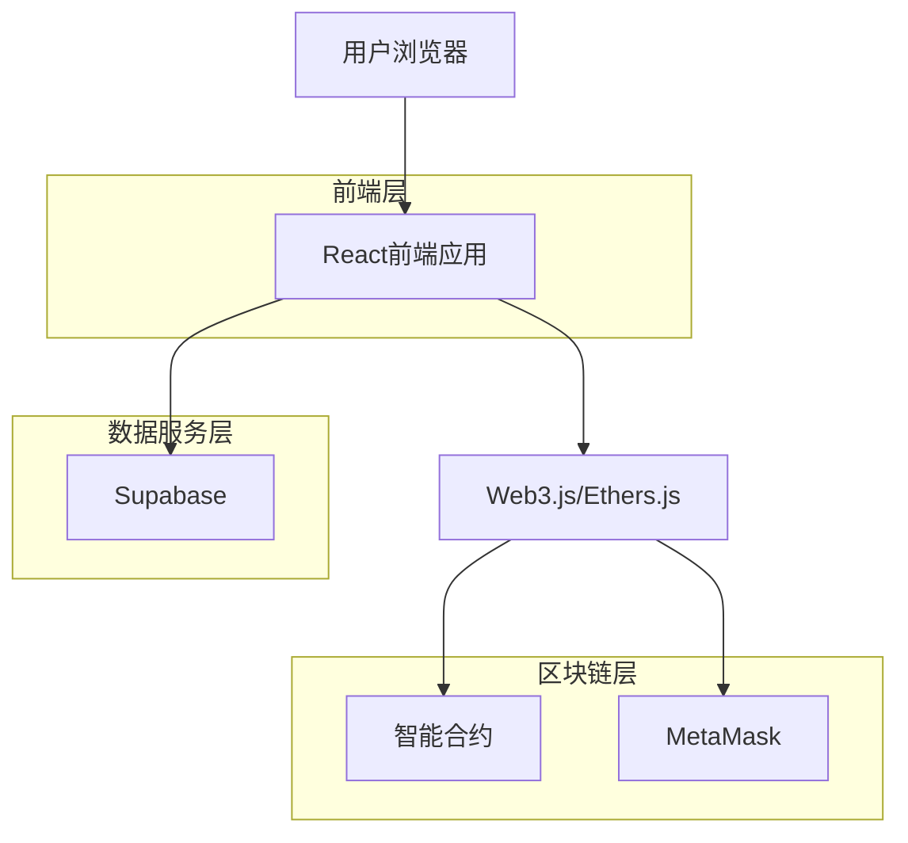
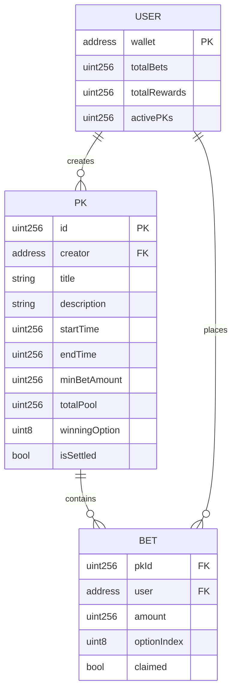

## 1. 架构设计



## 2. 技术描述

### 2.1 前端技术栈
- **前端框架**: React@18 + TypeScript
- **构建工具**: Vite
- **样式方案**: TailwindCSS@3 + Styled-components
- **状态管理**: React Context + useReducer
- **区块链交互**: Web3.js@1.x 或 Ethers.js@5.x
- **钱包连接**: Web3Modal 或 WalletConnect
- **图表库**: Recharts 或 Chart.js
- **初始化工具**: vite-init

### 2.2 智能合约技术
- **合约语言**: Solidity@0.8.x
- **开发框架**: Hardhat 或 Truffle
- **测试框架**: Chai + Mocha
- **合约验证**: Etherscan验证
- **安全审计**: OpenZeppelin合约标准

### 2.3 数据存储
- **区块链存储**: 核心PK数据和资金信息存储在链上
- **链下数据**: 用户资料、PK元数据存储在Supabase
- **缓存服务**: 使用Supabase的实时订阅功能

## 3. 路由定义

| 路由路径 | 页面功能 |
|---------|---------|
| / | 首页，展示PK列表和平台统计 |
| /pk/:id | PK详情页，显示具体PK信息和投票界面 |
| /create | 发起PK页面，创建新的PK挑战 |
| /profile | 个人中心，查看个人PK和参与历史 |
| /wallet | 钱包连接页面，管理钱包连接状态 |

## 4. 智能合约接口定义

### 4.1 核心合约接口

#### 创建PK
```solidity
function createPK(
    string memory _title,
    string memory _description,
    string[] memory _options,
    uint256 _duration,
    uint256 _minBetAmount
) external payable returns (uint256 pkId)
```

#### 参与投票
```solidity
function placeBet(
    uint256 _pkId,
    uint8 _optionIndex
) external payable
```

#### 结算PK
```solidity
function settlePK(uint256 _pkId, uint8 _winningOption) external
```

#### 提取奖励
```solidity
function claimReward(uint256 _pkId) external
```

### 4.2 数据结构定义

#### PK结构体
```solidity
struct PK {
    address creator;
    string title;
    string description;
    string[] options;
    uint256 startTime;
    uint256 endTime;
    uint256 minBetAmount;
    uint256 totalPool;
    uint8 winningOption;
    bool isSettled;
    mapping(uint8 => uint256) optionPools;
}
```

#### 用户投注记录
```solidity
struct UserBet {
    uint256 amount;
    uint8 optionIndex;
    bool claimed;
}
```

## 5. 前端架构设计

### 5.1 组件结构
```
src/
├── components/
│   ├── common/
│   │   ├── Header.tsx
│   │   ├── Footer.tsx
│   │   ├── ConnectWallet.tsx
│   │   └── LoadingSpinner.tsx
│   ├── pk/
│   │   ├── PKCard.tsx
│   │   ├── PKList.tsx
│   │   ├── PKDetail.tsx
│   │   ├── VotingInterface.tsx
│   │   └── CreatePKForm.tsx
│   └── profile/
│       ├── ProfileStats.tsx
│       ├── MyPKList.tsx
│       └── BetHistory.tsx
├── hooks/
│   ├── useWeb3.ts
│   ├── useContract.ts
│   ├── usePK.ts
│   └── useWallet.ts
├── contexts/
│   ├── Web3Context.tsx
│   ├── PKContext.tsx
│   └── UserContext.tsx
├── utils/
│   ├── contract.ts
│   ├── format.ts
│   └── constants.ts
└── types/
    ├── contract.ts
    └── pk.ts
```

### 5.2 状态管理
- **Web3状态**: 钱包连接、网络信息、账户余额
- **PK状态**: PK列表、详情、投票状态
- **用户状态**: 个人资料、投注历史、奖励信息

## 6. 数据模型

### 6.1 链上数据模型



### 6.2 链下数据模型（Supabase）

#### 用户表 (users)
```sql
CREATE TABLE users (
    id UUID PRIMARY KEY DEFAULT gen_random_uuid(),
    wallet_address VARCHAR(42) UNIQUE NOT NULL,
    username VARCHAR(50),
    avatar_url TEXT,
    total_bets DECIMAL(30, 18) DEFAULT 0,
    total_rewards DECIMAL(30, 18) DEFAULT 0,
    created_at TIMESTAMP WITH TIME ZONE DEFAULT NOW(),
    updated_at TIMESTAMP WITH TIME ZONE DEFAULT NOW()
);

CREATE INDEX idx_users_wallet ON users(wallet_address);
```

#### PK元数据表 (pk_metadata)
```sql
CREATE TABLE pk_metadata (
    id UUID PRIMARY KEY DEFAULT gen_random_uuid(),
    pk_id BIGINT UNIQUE NOT NULL,
    title VARCHAR(200) NOT NULL,
    description TEXT,
    category VARCHAR(50),
    tags TEXT[],
    image_url TEXT,
    created_at TIMESTAMP WITH TIME ZONE DEFAULT NOW()
);

CREATE INDEX idx_pk_metadata_pk_id ON pk_metadata(pk_id);
CREATE INDEX idx_pk_metadata_category ON pk_metadata(category);
```

## 7. 安全设计

### 7.1 智能合约安全
- **重入攻击防护**: 使用Checks-Effects-Interactions模式
- **整数溢出**: 使用Solidity 0.8.x内置溢出检查
- **访问控制**: 使用OpenZeppelin的Ownable和AccessControl
- **输入验证**: 严格验证所有外部输入参数
- **紧急暂停**: 实现Pausable功能应对紧急情况

### 7.2 前端安全
- **输入验证**: 客户端和服务端双重验证
- **XSS防护**: 使用React内置的XSS防护
- **CSRF防护**: 使用JWT令牌验证用户身份
- **私钥安全**: 私钥永不离开用户钱包
- **HTTPS**: 强制使用HTTPS加密通信

## 8. 性能优化

### 8.1 合约优化
- **Gas优化**: 使用存储优化技术减少Gas消耗
- **批量操作**: 支持批量查询和批量结算
- **事件日志**: 使用事件替代存储降低Gas费用
- **代理模式**: 使用可升级合约模式便于维护

### 8.2 前端优化
- **懒加载**: 按需加载组件和数据
- **缓存策略**: 使用React Query缓存区块链数据
- **分页加载**: 大量数据使用分页加载
- **WebSocket**: 实时更新PK状态和用户余额

## 9. 测试策略

### 9.1 合约测试
- **单元测试**: 覆盖所有合约函数
- **集成测试**: 测试完整的PK生命周期
- **安全测试**: 使用Slither等工具进行安全扫描
- **Gas测试**: 优化Gas消耗

### 9.2 前端测试
- **组件测试**: 使用React Testing Library
- **集成测试**: 测试Web3交互和合约调用
- **端到端测试**: 使用Cypress测试完整用户流程
- **性能测试**: 测试大量数据下的渲染性能

## 10. 部署方案

### 10.1 合约部署
- **测试网**: 先部署到Goerli或Sepolia测试网
- **主网**: 经过充分测试后部署到Ethereum主网
- **验证**: 在Etherscan上验证合约源代码
- **监控**: 设置合约事件监控和报警

### 10.2 前端部署
- **构建**: 使用Vite进行生产构建
- **CDN**: 部署到Vercel或Netlify等CDN平台
- **域名**: 配置HTTPS域名和DNS
- **监控**: 集成错误监控和用户行为分析