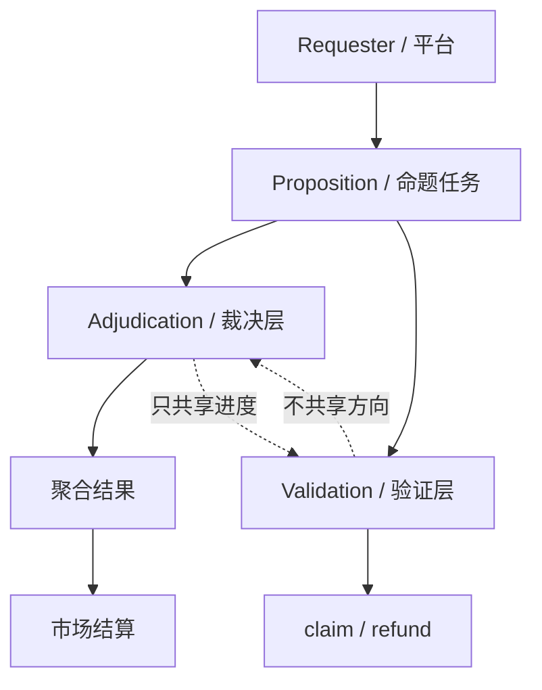

# Arena 项目理解文档

> 适用范围: `A+B`  
> 目标: 让开发者和 AI 用同一套语言理解这个项目的产品形状、实现边界和当前 MVP。

## 1. 一句话定义

Arena 是一个“可验证人群共识 + 调研 + 结果验证”的双层平台。

- `裁决层` 负责分发命题/问卷、收集回答、质检、聚合共识。
- `验证层` 负责围绕未来将公开的聚合结果进行下注、结算、claim/refund。
- 同一用户可以同时参与两层，但开奖前不能泄露方向信息。

## 2. 核心原则

- 系统隔离的不是用户身份，而是实时信息流。
- 裁决层不能看到市场方向、赔率倾向、下注分布。
- 验证层不能看到当前回答倾向、领先方、实时票向。
- 开奖前只公开进度，不公开方向。

## 3. 角色

- `Respondent`：回答命题/问卷的人。
- `Trader / Verifier`：围绕结果下注的人。
- `Requester`：发布命题/问卷的一方。

同一钱包可以扮演多个角色。

## 4. 产品模型

### 4.1 逻辑分层

### 4.2 命题类型

愿景上，命题可以是:

- `Consensus`：二选一共识命题。
- `Survey`：多题调研问卷。
- `Hybrid`：前半问卷，后半共识验证。

但**当前仓库的实际 MVP 只支持**:

- `consensus`
- `binary`
- `non_rolling`
- `final`

也就是: 单题、二选一、非滚动、最终结算。

## 5. 当前 MVP 边界

当前实现只解决验证层最小闭环:

- 市场创建
- 市场开启 / 冻结
- 原生资产下注托管
- 官方结果写入
- 用户自助 `claim`
- 异常场景 `refund`

当前**不**作为一期目标的能力:

- survey / hybrid
- rolling 题
- AMM
- 订单簿
- 多资产下注
- 复杂画像系统
- 复杂风控模型
- 公开方向性中间态

## 6. 生命周期与状态

### 6.1 Proposition

当前 shared 枚举里的状态为:

- `draft`
- `scheduled`
- `live`
- `frozen`
- `revealing`
- `settled`
- `closed`
- `archived`

### 6.2 Market

当前 shared 枚举里的状态为:

- `pre_live`
- `live`
- `frozen_for_reveal`
- `settling`
- `settled`
- `cancelled`

### 6.3 关键语义

- `frozen` / `frozen_for_reveal`: 停止继续下注，等待结果进入。
- `revealing` / `settling`: 结果处理中的过渡态。
- `settled` / `closed` / `archived`: 已可对外展示最终结果。

如果旧文档和代码冲突，以 `packages/shared/src/arena/enums.ts` 为准。

## 7. 仓库里的实现映射

| 概念 | 主要代码位置 |
| --- | --- |
| 领域枚举与状态 | `packages/shared/src/arena/enums.ts` |
| 命题约束与 MVP 限制 | `packages/shared/src/arena/proposition/policy.ts` |
| 公共进度视图 | `packages/shared/src/arena/application/public-progress.ts` |
| 结果视图 | `packages/shared/src/arena/application/result-surface.ts` |
| 裁决层服务 | `apps/api/src/arena/services/*` |
| 验证层服务 | `apps/api/src/arena/services/market.service.ts`, `bet.service.ts`, `validation-settlement.service.ts` |
| 前端裁决/验证/结果页面 | `apps/web/src/features/*`, `apps/web/src/components/*`, `apps/web/src/app/*` |
| 验证层合约 | `contracts/validation/*` |
| 约束与运行手册 | `docs/contracts/*` |

## 8. 给开发者的实现约束

- 不要把 `survey`、`hybrid`、`rolling` 当成已完成能力。
- 不要把方向性信息暴露到公共进度里。
- 不要把历史命名当成新产品定义。
- 改状态机时，`shared enums`、API、前端、测试要一起更新。
- 先保住“可验证的产品形状”，再补实现细节。

## 9. 给 AI 的阅读顺序

1. `packages/shared/src/arena/enums.ts`
2. `packages/shared/src/arena/proposition/policy.ts`
3. `packages/shared/src/arena/application/public-progress.ts`
4. `packages/shared/src/arena/application/result-surface.ts`
5. `apps/api/src/arena/services/*`
6. `apps/web/src/features/*`
7. `docs/contracts/arena-phase1-spec.md`

## 10. 最终理解

Arena 的本质不是“普通预测市场”。

它是一个把“人群回答”与“围绕结果的验证/交易”结合起来的双层系统:

- 裁决层生产共识
- 验证层交易共识
- 开奖前只共享进度，不共享方向

